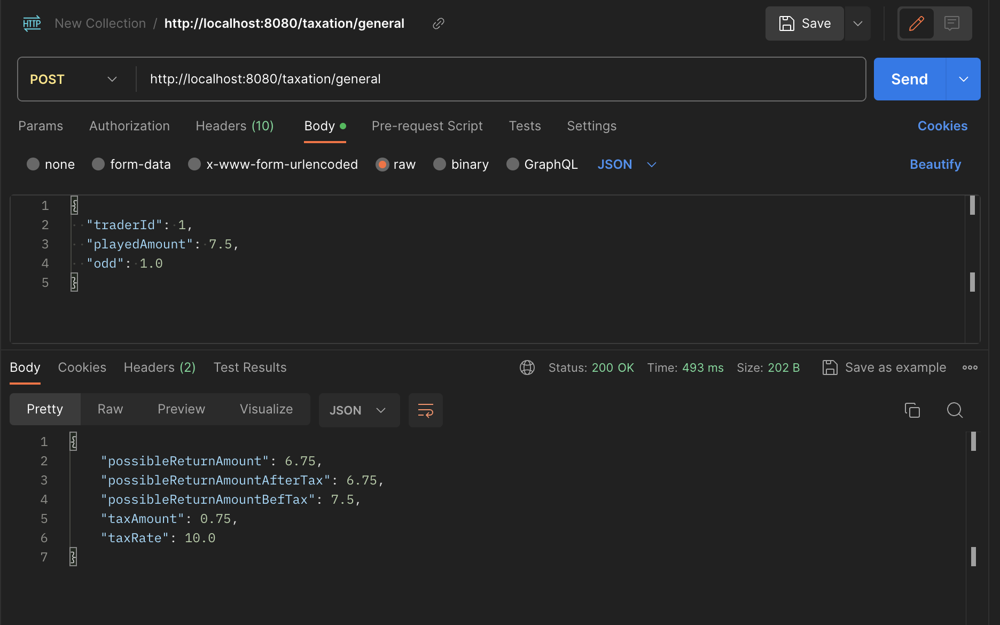
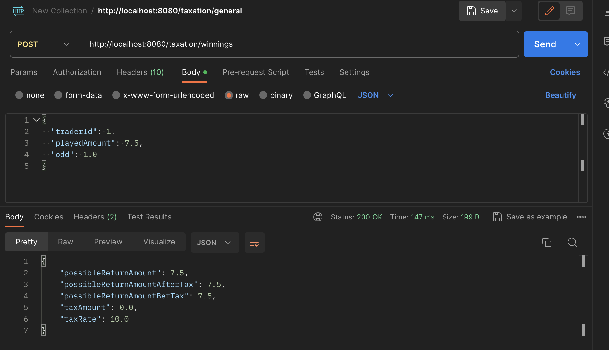

# taxation-service

This project uses Quarkus, the Supersonic Subatomic Java Framework.

If you want to learn more about Quarkus, please visit its website: <https://quarkus.io/>.

## Assumptions

We are assuming that each country has tax rules set in stone, and we put those rules in the `CountryTaxRules` table.

## Endpoints

For simplicity, we have two endpoints:
- `/taxation/general`: Calculates general taxation.
- `/taxation/winnings`: Calculates winnings taxation.

This project uses Swagger to generate API documentation. The Swagger UI is available at:
http://localhost:8080/q/swagger-ui/

## Database Tables

We have three tables in our database:
1. `country_tax_rules`: Contains the tax rules for each country.
2. `trader`: Contains the traders and their respective countries.
3. `taxation`: Stores the responses from the two endpoints in `TaxationResource`.

### Import Data

The `country_tax_rules` and `trader` tables are populated with initial data using the `import.sql` file.

- The `trader` table has some users that we can use, and each of those users belongs to a certain country that has different tax rules. Here are the users with `traderId` from 1 to 4:
    - Trader A (Germany)
    - Trader B (France)
    - Trader C (Spain)
    - Trader D (Italy)

- The `taxation` table is filled with all the responses from the two endpoints in `TaxationResource`.

## Running the Application in Development Mode

You can run your application in development mode with live coding enabled using the following command:
```bash
./mvnw quarkus:dev
```

### Available Endpoints
The project provides two REST API endpoints for processing files and retrieving timestamps. Below are the details:

### 1. Calculate General Taxation



HTTP Method: POST
URL:  /taxation/general

Description: Calculates general taxation for the request.

Example Request:
```bash
curl -X POST "http://localhost:8080/taxation/general" -H "Content-Type: application/json" -d '{"traderId": 1, "playedAmount": 7.5, "odd": 1.0}'
```

Example Response:
Success (200 OK):

`{
    "possibleReturnAmount": 6.75,
    "possibleReturnAmountAfterTax": 6.75,
    "possibleReturnAmountBefTax": 7.5,
    "taxAmount": 0.75,
    "taxRate": 10.0
}
`

### 2. Calculate Winnings Taxation



HTTP Method: GET
URL:  /taxation/winnings

Description: Calculates winnings taxation for the request.

Example Request:
```bash
curl -X POST "http://localhost:8080/taxation/winnings" -H "Content-Type: application/json" -d '{"traderId": 1, "playedAmount": 7.5, "odd": 1.0}'
```

Example Response:
Success (200 OK):

`{
    "possibleReturnAmount": 7.5,
    "possibleReturnAmountAfterTax": 7.5,
    "possibleReturnAmountBefTax": 7.5,
    "taxAmount": 0.0,
    "taxRate": 10.0
}`
